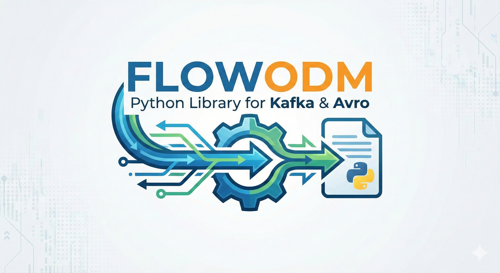

<div align="center">
  
</div>

# FlowODM

[](https://badge.fury.io/py/flowodm)
[](https://pypi.org/project/flowodm/)
[](https://github.com/Aprova-GmbH/flowodm/actions)
[](https://codecov.io/gh/vykhand/flowodm)
[](https://opensource.org/licenses/Apache-2.0)
[](https://github.com/psf/black)

A lightweight ODM for Apache Kafka® with Avro schema support.

FlowODM provides a Pydantic v2-based interface for working with Kafka messages and Avro schemas. It supports both synchronous and asynchronous operations, making it ideal for building microservices.

## Features

- **Pydantic v2 Models**: Define Kafka messages as Pydantic models
- **Avro Schema Support**: Auto-generate schemas or validate against existing ones
- **Schema Registry Integration**: Full support for Confluent Schema Registry
- **Dual Sync/Async API**: Both sync and async methods for all operations
- **Consumer Loop Patterns**: Ready-to-use patterns for building microservices
- **Predefined Settings**: Optimized configurations for different use cases
- **CLI Tools**: Validate schemas, upload to registry, check compatibility

## Installation

```bash
pip install flowodm
```

## Quick Start

### Define a Model

```python
from datetime import datetime
from flowodm import FlowBaseModel, connect

# Connect to Kafka
connect(
    bootstrap_servers="localhost:9092",
    schema_registry_url="http://localhost:8081"
)

# Define your model
class UserEvent(FlowBaseModel):
    class Settings:
        topic = "user-events"
        consumer_group = "my-service"
        key_field = "user_id"

    user_id: str
    action: str
    timestamp: datetime
```

### Produce Messages

```python
# Sync
event = UserEvent(user_id="123", action="login", timestamp=datetime.now())
event.produce()

# Async
await event.aproduce()

# Batch
events = [UserEvent(...) for _ in range(100)]
UserEvent.produce_many(events)
```

### Consume Messages

```python
# Single message
event = UserEvent.consume_one(timeout=5.0)

# Iterator
for event in UserEvent.consume_iter():
    print(f"User {event.user_id} performed {event.action}")

# Async iterator
async for event in UserEvent.aconsume_iter():
    await process(event)
```

### Consumer Loop for Microservices

```python
from flowodm import ConsumerLoop, LongRunningSettings

def process_event(event: UserEvent) -> None:
    # Your processing logic
    print(f"Processing {event.user_id}")

loop = ConsumerLoop(
    model=UserEvent,
    handler=process_event,
    settings=LongRunningSettings(),  # Tolerates long processing
)
loop.run()  # Blocking, handles SIGTERM gracefully
```

### Async Consumer Loop

```python
from flowodm import AsyncConsumerLoop

async def process_event(event: UserEvent) -> None:
    await external_api.submit(event)

loop = AsyncConsumerLoop(
    model=UserEvent,
    handler=process_event,
    max_concurrent=20,  # Process up to 20 messages concurrently
)
await loop.run()
```

## Schema Registry Integration

### Validate Models Against Registry

```python
from flowodm import validate_against_registry

result = validate_against_registry(UserEvent, "user-events-value")
if not result.is_valid:
    print(f"Errors: {result.errors}")
```

### Generate Models from Schema

```python
from flowodm import generate_model_from_registry

# Generate Pydantic model from registered schema
UserEvent = generate_model_from_registry(
    subject="user-events-value",
    topic="user-events",
)
```

### CLI Tools

```bash
# Validate models against Schema Registry
flowodm validate --models myapp.events --registry

# Upload schema to registry
flowodm upload-schema --avro schemas/user_event.avsc --subject user-events-value

# Check compatibility
flowodm check-compatibility --model myapp.events.UserEvent --level BACKWARD

# List all subjects
flowodm list-subjects
```

## Predefined Settings

FlowODM provides optimized settings for different use cases:

| Profile | Use Case |
|---------|----------|
| `LongRunningSettings` | ML inference, complex processing (10 min timeout) |
| `BatchSettings` | ETL jobs, data aggregation (large batches) |
| `RealTimeSettings` | Event-driven, notifications (low latency) |
| `HighThroughputSettings` | High-volume ingestion (max throughput) |
| `ReliableSettings` | Financial transactions (exactly-once) |

```python
from flowodm import LongRunningSettings, ConsumerLoop

loop = ConsumerLoop(
    model=MyModel,
    handler=my_handler,
    settings=LongRunningSettings(),
)
```

## Configuration

Configure via environment variables:

```bash
# Kafka
KAFKA_BOOTSTRAP_SERVERS=localhost:9092
KAFKA_SECURITY_PROTOCOL=SASL_SSL
KAFKA_SASL_MECHANISM=PLAIN
KAFKA_SASL_USERNAME=your-api-key
KAFKA_SASL_PASSWORD=your-api-secret

# Schema Registry
SCHEMA_REGISTRY_URL=https://your-registry.confluent.cloud
SCHEMA_REGISTRY_BASIC_AUTH_USER_INFO=your-sr-api-key:your-sr-api-secret  # Or use separate key/secret:
# SCHEMA_REGISTRY_API_KEY=your-sr-api-key
# SCHEMA_REGISTRY_API_SECRET=your-sr-api-secret
```

Or programmatically:

```python
from flowodm import connect

connect(
    bootstrap_servers="localhost:9092",
    security_protocol="SASL_SSL",
    sasl_mechanism="PLAIN",
    sasl_username="api-key",
    sasl_password="api-secret",
    schema_registry_url="https://registry.confluent.cloud",
    # Option 1: Combined format
    schema_registry_basic_auth_user_info="sr-key:sr-secret",
    # Option 2: Separate key/secret
    # schema_registry_api_key="sr-key",
    # schema_registry_api_secret="sr-secret",
)
```

## CI/CD Schema Validation

Add schema validation to your CI pipeline:

```yaml
# .github/workflows/schema-validation.yml
- name: Validate schemas
  run: |
    pip install flowodm
    flowodm validate --models myapp.events --registry --strict
```

See the [documentation](https://flowodm.readthedocs.io) for more CI/CD examples.

## License

Apache License 2.0

## Trademark Notice

Apache Kafka is a registered trademark of the Apache Software Foundation.
